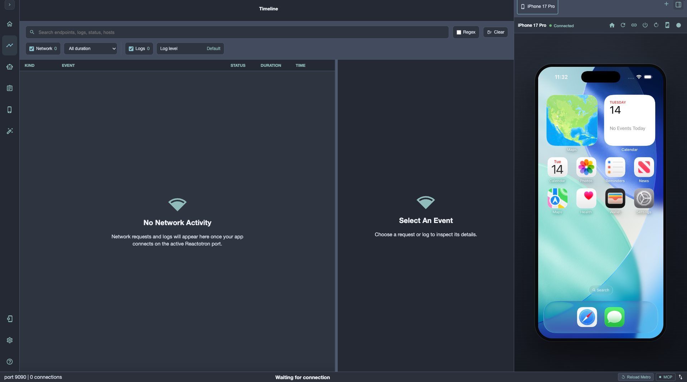
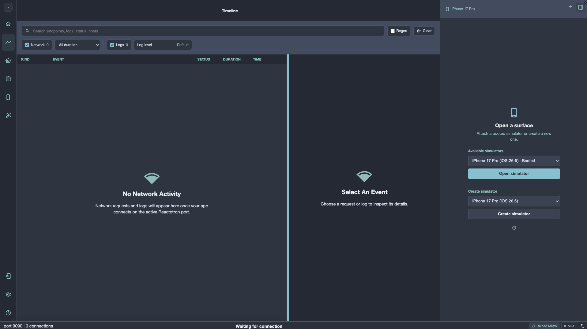
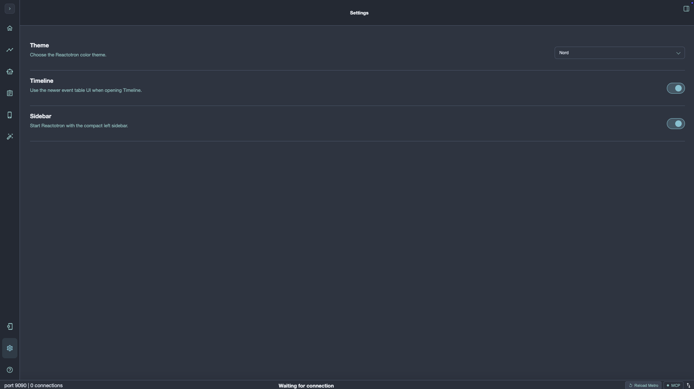

#  Reactotron

Reactotron is a desktop debugger for React and React Native. It brings application state, network traffic, logs, runtime UI, agent tools, and iOS Simulator control into one focused workspace.

## What you can do

- Inspect network requests, responses, headers, payloads, and timing alongside application logs.
- Search and filter traffic by method, status, duration, content type, host, endpoint, time window, and duplicates.
- Explore React Native runtime UI through the Agent screen, using `testID`, labels, text, roles, and placeholders to find nodes and run supported actions.
- Connect coding agents through MCP for runtime inspection, UI actions, and desktop simulator workflows.
- Open and control iOS Simulators from Reactotron on macOS, without switching to Simulator.app.
- Choose a named theme, use a compact sidebar, and tailor the Timeline layout to your workflow.
- Debug the rest of your app with Reactotron’s established state, Redux, MobX-State-Tree, Async Storage, overlay, Storybook, benchmark, and custom-command tools.

## A modern desktop workspace

The Timeline is a single place to investigate API activity and logs. Keep the event list visible while inspecting details, resize the inspector to suit the task, and move between readable summary, request, response, headers, and raw data views.

### Network and logs

Use the Timeline to:

- Search endpoints, logs, status codes, and hosts.
- Filter network events by method, status, duration, content type, host, endpoint, time window, and duplicates.
- Select log levels independently from network traffic.
- Inspect formatted, tree, or raw payloads and copy the data you need.
- Keep a resizable inspector open while you compare requests and responses.

### Agentic development and MCP

The Agent screen turns a connected React Native app into an inspectable runtime surface. Request a UI snapshot, search nodes by `testID`, label, text, role, or placeholder, then run supported press and fill actions. Accessibility selectors and scroll actions make the runtime usable by both people and coding agents.

Reactotron’s MCP server exposes the same runtime and desktop capabilities to supported coding agents. See the [MCP guide](./docs/mcp.md) for setup and available tools.

### Themes and layout

Choose a named color theme in Settings, switch to the compact sidebar, and opt into the newer Timeline event-table interface.

## Embedded iOS Simulator (macOS)

Open the simulator panel to discover a booted iOS Simulator or create a new iPhone simulator from an installed runtime. Reactotron manages the local stream and gives you a first-class device surface with tabs, connection state, and device controls.

Requirements:

- macOS with Xcode Command Line Tools.
- At least one installed iOS Simulator runtime.

The embedded device supports Home, reload, reconnect, shutdown, rotation, light/dark appearance, pointer gestures, US-ASCII keyboard input, and paste. Screenshot capture offers **Save to File** or **Copy to Clipboard**. Recording begins immediately, displays a red **REC** state, and asks where to save only after you stop it.

| Shortcut      | Action                                                            |
| ------------- | ----------------------------------------------------------------- |
| `Cmd+S`       | Capture a screenshot and choose Save to File or Copy to Clipboard |
| `Cmd+R`       | Start recording; press again to stop and choose where to save     |
| `Cmd+Shift+A` | Toggle the simulator between light and dark appearance            |

## Install

Download the desktop app from the [Releases](https://github.com/hurajgor/reactotron/releases) page for macOS, Linux, or Windows.

Add the Reactotron client to your application as a development dependency so it does not affect production builds.

## Get started

- [React Native quick start](https://docs.infinite.red/reactotron/quick-start/react-native/)
- [React quick start](https://docs.infinite.red/reactotron/quick-start/react-js/)
- [MCP setup and tools](./docs/mcp.md)
- [Tips and tricks](./docs/tips.md)
- [Troubleshooting](./docs/troubleshooting.md)

## Plugins and integrations

Reactotron includes integrations for [global errors](https://docs.infinite.red/reactotron/plugins/track-global-errors/), [global logs](./docs/plugins/track-global-logs.md), [networking](https://docs.infinite.red/reactotron/plugins/networking/), [Async Storage](https://docs.infinite.red/reactotron/plugins/async-storage/), [React Native MMKV](https://docs.infinite.red/reactotron/plugins/react-native-mmkv/), [benchmarks](https://docs.infinite.red/reactotron/plugins/benchmark/), [apisauce](https://docs.infinite.red/reactotron/plugins/apisauce/), [overlays](https://docs.infinite.red/reactotron/plugins/overlay/), [MST](https://docs.infinite.red/reactotron/plugins/mst/), [Redux](https://docs.infinite.red/reactotron/plugins/redux/), [Open in Editor](https://docs.infinite.red/reactotron/plugins/open-in-editor/), [Storybook](https://docs.infinite.red/reactotron/plugins/storybook/), and [custom commands](./docs/custom-commands.md).

## Contributing

- [Contributing guide](https://docs.infinite.red/reactotron/contributing/)
- [Architecture](https://docs.infinite.red/reactotron/contributing/architecture/)
- [Monorepo guide](https://docs.infinite.red/reactotron/contributing/monorepo/)
- [Release process](https://docs.infinite.red/reactotron/contributing/releasing/)

## Credits

Reactotron is developed by [Infinite Red](https://infinite.red), [@rmevans9](https://github.com/rmevans9), and 70+ contributors. Special thanks to [@skellock](https://github.com/skellock) for originally creating Reactotron while at Infinite Red.
